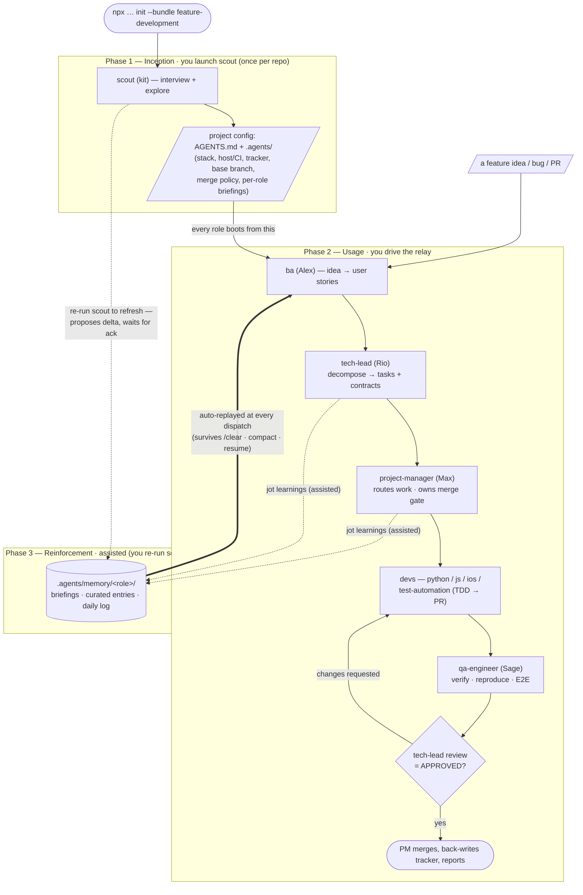

# Feature Development Team (`feature-development`)

A cross-platform product-delivery team you install in one shot, then **pick the
developer roles you need** — any combination, no stack lock-in. A requirements →
plan → build → verify → merge relay: **BA** shapes stories, **tech-lead**
decomposes them, **PM** routes the work and owns the merge gate, **devs** build
(TDD), and **QA** verifies. The shared core roles auto-tune to whatever
platforms your selection spans (web JS/TS + Python, iOS Swift/SwiftUI).

## Install

```bash
npx github:arozumenko/sdlc-skills init --bundle feature-development
```

The installer always sets up the **core roles** (`scout`, `ba`,
`project-manager`, `tech-lead`, `qa-engineer`) and shows a checklist of
**developer roles** to add. Pick any subset — e.g. a Python backend dev + an iOS
dev — and the core `tech-lead` and `qa-engineer` automatically pick up the right
skills and briefings for the platforms you chose.

- `--yes` (or a non-interactive shell) installs **all** developer roles.
- `--agents python-dev,ios-dev` selects a subset non-interactively.

Drops the selected agents into `.claude/`, pulls their skills, seeds per-role
briefings, wires the memory/context hooks, and splices `instructions.md` into
`AGENTS.md`.

## Quick start

The team runs in **three phases**. Unlike the single-lead bundles, there is no
one orchestrator — you launch `scout` once to onboard the repo, then drive the
team as a **relay**: `ba` → `tech-lead` → `project-manager` → devs + `qa-engineer`.
Each role hands off to the next via host-native subagent dispatch.

**Phase 1 — Inception (`scout`, once per repo).** Launch scout: _"Use the
scout agent to onboard this repo."_ It asks you what it can't infer, explores
the repo, then generates the project config — `AGENTS.md` plus the `.agents/`
set, recording the stack, code host + CI, issue tracker, base branch, and merge
policy into `profile.md` / `workflow.md` / `team-comms.md`, and seeding a
per-role briefing under `.agents/memory/<role>/`. **Why it's first:** every
other role reads this config at dispatch — if the project isn't seeded, the PM
and tech-lead pause and ask for a scout run before routing anything.

**Phase 2 — Usage (the relay).** Hand a feature idea to the **BA**: _"Use the ba
agent to turn this into user stories."_ From there the work flows down the chain:

- **`ba` (Alex)** turns the vague idea into user stories with acceptance
  criteria, then hands off to the tech-lead.
- **`tech-lead` (Rio)** decomposes each story into dependency-ordered tasks with
  interface contracts and a critical path, then hands off to the PM.
- **`project-manager` (Max)** routes tasks to the right devs (inline,
  sub-agent, or parallel) and owns the **merge gate**.
- **devs** (`python-dev` / `js-dev` / `ios-dev` / `test-automation-engineer`)
  implement with TDD and open a PR.
- **`qa-engineer` (Sage)** verifies the change — reproduces bugs with evidence,
  runs the E2E path, treats every green test with suspicion.
- **`tech-lead`** does a **blocking code review**; on approval the **PM merges**,
  back-writes the tracker, and reports.

You can enter the relay at any role (drop a bug straight on the tech-lead, a PR
straight on the PM), but the default path is BA → tech-lead → PM. **The logic:**
each role boots from a fresh context that the `agent-start` hook seeds with the
shared `.agents/*` config and its own memory — so every role already knows the
stack, the merge policy, and who to hand off to.

**Phase 3 — Reinforcement (assisted; you re-run scout).** Two moving parts, and
only one is automatic:
- **Replay is automatic.** The hooks re-inject each role's memory snapshot and
  the shared `.agents/*` config at every dispatch (survives `/clear`,
  compaction, resume) — it only replays what's already written.
- **Capture is assisted.** The roles jot durable facts (architecture
  decisions, recurring review patterns, domain clarifications) into
  `.agents/memory/<role>/` when worth keeping, and you periodically **re-run
  `scout`** to refresh the shared config + briefings — scout re-reads the
  **code, PR history, and (via the `session-retrospective` skill) past agent
  sessions**, proposes the delta, and **waits for your ack**.

### How it flows



## Roster

**Core (always installed):**

| Role | Agent | Job |
|---|---|---|
| Onboarding | `scout` (kit) | Seeds stack / host / tracker / base branch / merge policy into `.agents/`. Re-run to refresh. |
| Business analyst | `ba` (Alex) | Turns vague ideas into user stories + acceptance criteria; hands off to tech-lead. |
| Tech lead | `tech-lead` (Rio) | Decomposes stories into dependency-ordered tasks with interface contracts; owns architecture + the blocking code review. |
| Project manager | `project-manager` (Max) | Routes tasks to devs (inline / sub-agent / parallel); owns the merge gate and status reporting. |
| QA | `qa-engineer` (Sage) | Verifies features, reproduces bugs with evidence, runs the E2E path. |

**Developer roles (pick any combination):**

| Role | Agent | Platform | Focus |
|---|---|---|---|
| Python backend | `python-dev` (Py) | web | FastAPI services / FastMCP servers |
| JS/TS frontend | `js-dev` (Jay) | web | React / Next.js / Node (TypeScript) |
| Test automation | `test-automation-engineer` (Axel) | web | End-to-end automation (Playwright), AFS → green test |
| iOS app | `ios-dev` (Io) | iOS | Swift / SwiftUI / SwiftData |

## How tuning works

Picking any **web** role activates the web briefings/skills for `tech-lead` and
`qa-engineer`; picking `ios-dev` activates the iOS ones. Pick both and the
shared roles get the **superset** — e.g. `qa-engineer` keeps Playwright *and*
gains the iOS testing skills (`swift-testing-pro`, `environment-setup-xcuitest`,
…). A bundle tunes the *installed copy* via two parallel overlays:
`briefings/` (behavior) and `skillOverlays` in `bundle.json` (capability). See
[`../SPEC.md`](../SPEC.md) for the overlay model.

## When to use it

- A **full feature-delivery** engagement — requirements through merge — on web,
  iOS, or both, where you want specialized roles handing off to each other
  rather than one generalist.
- You want platform-aware core roles (a tech-lead and QA that know your stack)
  without committing to a stack up front — pick the dev roles per project.

Compared to **`test-automation`**, which wraps a single orchestrator (Tal)
around the TMS → merged-test pipeline, this bundle is a broader delivery team
with no automation orchestrator — it includes `test-automation-engineer` and
`qa-engineer` as part of the relay. Compared to **`manual-qa`**, which runs
cases live with no code generated, this team builds and ships the feature
itself.

## What gets installed

- The **core roles** above, plus whichever **developer roles** you selected,
  with their declared skills.
- Per-role **briefings** seeded to `.agents/memory/<role>/project_briefing.md`,
  tuned to the platforms your selection spans.
- Team conventions spliced into `AGENTS.md` (inside
  `<!-- BUNDLE:feature-development -->` markers).
- Bundle-owned skills (`implement-feature`, `plan-feature`, `code-review`,
  `git-workflow`, `completing-a-task`, `test-automation-workflow`,
  `seeding-a-project`, `memory`, …) — real directories this bundle physically
  owns; the same id may differ in another bundle by design.

See [`bundle.json`](bundle.json) for the exact manifest and the top-level
[`../SPEC.md`](../SPEC.md) for how bundles are defined and installed.
