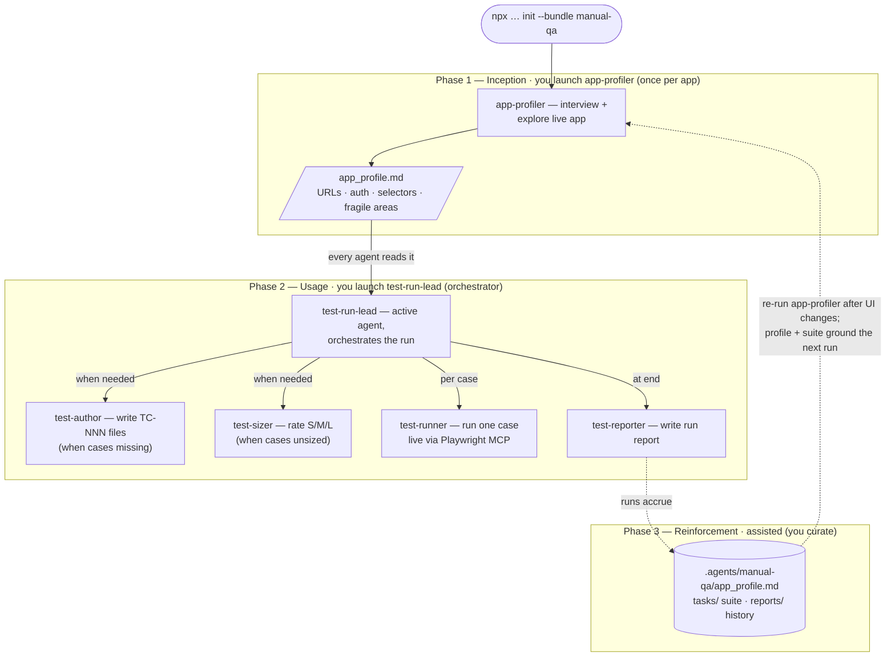

# Manual QA Team

A standalone agentic manual-QA team for web and mobile apps. Cases are authored
as structured Markdown and run live — web via Playwright MCP, mobile via Appium
MCP (local native) or the Mobitru device farm (cloud real devices) — no test
code is generated, making this distinct from a Playwright automation engineer.

## Install

```bash
npx github:arozumenko/sdlc-skills init --bundle manual-qa
```

Installs the 6 agents below into `.claude/agents/`, seeds QA reference docs
into `.agents/manual-qa/knowledge/`, and splices the team conventions into
`AGENTS.md` / `CLAUDE.md`.

## Quick start

The team runs in **three phases**. Unlike the other bundles there is no
`scout`: `app-profiler` onboards the app, then `test-run-lead` orchestrates
the rest — it authors and sizes cases when needed, runs them, and reports.

**Install (once)** — `npx github:arozumenko/sdlc-skills init --bundle manual-qa`.
Installs the 6 agents into `.claude/agents/`, seeds reference docs into
`.agents/manual-qa/knowledge/`, wires the context hooks, and splices
`instructions.md` into `AGENTS.md`.

**Phase 1 — Inception (`app-profiler`, once per app).** _"Use the
app-profiler agent to onboard this app."_ It **interviews you** (base URL,
what the app does, auth + test credentials, the 3–5 key flows, user roles,
external-service flows), then explores the running app live via Playwright
MCP and writes `.agents/manual-qa/app_profile.md` (URLs, auth, key pages,
reliable selectors, fragile areas). **Why it's first:** there's no scout
here — `app-profiler` is the onboarding agent, and every other manual-qa agent
reads this profile before acting.

**Phase 2 — Usage (`test-run-lead` orchestrates).** Launch `test-run-lead` as
the **active agent** with a suite path and `base_url` — it's the single
orchestrator for a run. It assembles the suite first, dispatching sub-agents
*when needed*:
- **`test-author`** — when the suite has no cases yet and you've given
  descriptions/flows to work from, it writes `tasks/<suite>/TC-NNN_<slug>.md`
  (URLs as `{{base_url}}/path`).
- **`test-sizer`** — when cases lack a `size:`, it scores them S/M/L for
  agent-execution cost and writes it into their frontmatter.

Then it runs the suite: one `test-runner` per case (each runs live via
Playwright MCP and must capture a confirming snapshot to record PASS),
followed by `test-reporter` writing `reports/RUN-YYYY-MM-DD-NNN.md`. You talk
only to the lead — don't invoke `test-sizer` / `test-author` / `test-runner` /
`test-reporter` by hand during a led run (you can still run sizer/author
standalone for authoring outside a run). **The logic:** every agent reads
`app_profile.md` for selectors and auth, so cases and runs stay grounded in
the real app.

**Phase 3 — Reinforcement (assisted; you curate — there's no scout here).**
The project's knowledge lives in durable, growing artifacts that every agent
re-reads on each run: `.agents/manual-qa/app_profile.md` (**re-run
`app-profiler`** after UI changes to refresh selectors and flows), the
`tasks/` suite (a living regression set), and the `reports/` history. None
of this is automatic — you decide when to re-profile and which cases to
keep. **The payoff:** runs get more reliable as the profile sharpens and the
suite grows — the team builds a lasting QA memory of *this* app rather than a
one-off pass. There is no mining of past chat or sub-agent transcripts;
refinement comes from re-profiling the live app and curating the suite.

### How it flows



## Roster

| Role | Invoke | Does |
|---|---|---|
| `app-profiler` | profiler | Onboards the app — explores the UI, maps flows, writes `.agents/manual-qa/app_profile.md` |
| `test-sizer` | sizer | Rates cases S/M/L for AI-agent execution cost; sizes descriptions before authoring and scores existing TC files into their `size:` frontmatter |
| `test-author` | author | Takes a feature or flow description and authors formatted test cases under `tasks/<suite>/` |
| `test-run-lead` | lead | **Run orchestrator** — assembles the suite (dispatches `test-author` / `test-sizer` when needed), runs one `test-runner` per case, triggers `test-reporter` |
| `test-runner` | runner | Runs one test case live via Playwright MCP and emits a structured JSON result |
| `test-reporter` | reporter | Collects test-runner results and writes the run report to `reports/` |

## How this team works

Onboard once with **app-profiler**, then drive **test-run-lead** — the single
run orchestrator. It must be invoked as the **active agent**; it dispatches
`test-author` and `test-sizer` to assemble the suite when needed, then a
`test-runner` per case and `test-reporter` at the end (all via the Agent
tool). You can also run `test-sizer` / `test-author` standalone for authoring
outside a run.

Test cases live in `tasks/<suite>/TC-NNN_<slug>.md`; run reports land in
`reports/RUN-YYYY-MM-DD-NNN.md` with screenshots in `reports/screenshots/`.
Reference docs (format guide, templates, report format) are seeded to
`.agents/manual-qa/knowledge/` at install time.

All test-case URLs use `{{base_url}}` — the test-run-lead or test-runner
substitutes the real base URL at run time, keeping cases environment-agnostic
across dev, staging, and prod.

## What this bundle adds

- **Agents** — the 6 local roles above (installed into `.claude/agents/`).
- **Instructions** — [`instructions.md`](instructions.md) → spliced into `AGENTS.md` / `CLAUDE.md`.
- **Seeded knowledge** — [`knowledge/`](knowledge/) → `.agents/manual-qa/knowledge/` (test-case format guide, template, report format).
- **Skills it pulls** — `playwright-testing`, `playwright-best-practices`, `verification-before-completion`, `systematic-debugging` (declared in the relevant agent frontmatter).
- **Bundle-owned skills** — [`skills/playwright-testing/`](skills/playwright-testing/), [`skills/xlsx-reader/`](skills/xlsx-reader/), [`skills/mobile-testing/`](skills/mobile-testing/) — real directories this bundle physically owns (declared in `localSkills`), installed when you install the bundle. The same id may exist in another bundle or the top-level `skills/` catalog with different content — that's fine, there is no sync. Edit these copies directly.
- **Briefings** — _(none)_.
- **Hooks** — _(none)_.

See [`bundle.json`](bundle.json) for the exact manifest and the top-level
[`../SPEC.md`](../SPEC.md) for how bundles are defined and installed.
