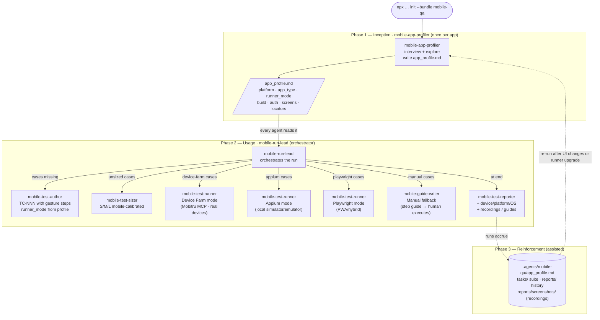

# Mobile QA Team

A standalone agentic manual-QA team for mobile apps. Cases are authored as
structured Markdown and run via Mobitru MCP (real cloud device farm), local
Appium MCP (simulator/emulator), Playwright MCP (PWA/hybrid with mobile viewport),
or guided manual mode (native fallback when no MCP runner is available). No test
code is generated — this is distinct from an Appium automation engineer.

## Install

```bash
npx github:arozumenko/sdlc-skills init --bundle mobile-qa
```

Installs the 7 agents below into `.claude/agents/`, seeds mobile QA reference docs
into `.agents/mobile-qa/knowledge/`, and splices the team conventions into
`AGENTS.md` / `CLAUDE.md`.

After installing, register the MCP servers you need (see `.env.example` for token setup):

```bash
# Mobitru device farm — real cloud devices (runner_mode: device-farm)
claude mcp add mobitru -e DEVICE_FARM_API_KEY=$DEVICE_FARM_API_KEY -e DEVICE_FARM_SLUG=$DEVICE_FARM_SLUG -e DEVICE_FARM_BASE_URL=app.mobitru.com -- npx -y mobitru-mcp-server@latest mobile

# Local Appium — simulator / emulator / USB device (runner_mode: appium)
claude mcp add appium-mcp -- npx -y appium-mcp@latest

# Playwright — PWA / hybrid only; usually pre-installed (runner_mode: playwright)
claude mcp add playwright -- npx -y @playwright/mcp@latest
```

## Quick Start

The team runs in **three phases**. The profiler sets `runner_mode` once from what
MCP servers are available; everything else follows automatically.

**Phase 1 — Inception (`mobile-app-profiler`, once per app).** _"Use the
mobile-app-profiler agent to onboard this app."_ It interviews you (platform, app
type, build access, auth, key flows, permissions) and explores the app live — via
Mobitru MCP (native, real cloud device), local Appium MCP (native, simulator/emulator),
or Playwright MCP (PWA/hybrid with mobile viewport). When no MCP runner is available,
it guides you to provide screenshots and documents the UI from them. Writes
`.agents/mobile-qa/app_profile.md`. **The profile is authoritative:** it determines
the `runner_mode` that every test case and runner will use.

**Phase 2 — Usage (`mobile-run-lead` orchestrates).** Launch `mobile-run-lead` as
the **active agent** with a suite path — it is the single orchestrator for a run:
- **`mobile-test-author`** — writes `tasks/<suite>/TC-NNN_<slug>.md` with mobile
  gesture steps, platform tags, and `runner_mode` set from the profile.
- **`mobile-test-sizer`** — scores cases S/M/L. Biometrics and camera steps are M
  on device-farm (injectable), L on appium/manual.
- **`mobile-test-runner`** — one per case, three automated modes:
  - **Device Farm** (`device-farm`): real iOS/Android device via Mobitru MCP; biometric injection (`inject_touch`), camera mocking (`inject_image`), screen recording. Emits PASS/FAIL + `.mp4`.
  - **Appium** (`appium`): native automation on local simulator/emulator via Appium MCP. Emits PASS/FAIL.
  - **Playwright** (`playwright`): PWA/hybrid via Playwright MCP with mobile viewport + touch emulation. Emits PASS/FAIL.
- **`mobile-guide-writer`** — fallback when no MCP runner is available: generates a
  step-by-step execution guide to `reports/manual-guides/TC-NNN-guide.md`. Emits BLOCKED (expected).
- **`mobile-test-reporter`** — writes `reports/RUN-YYYY-MM-DD-NNN.md` with
  device/platform/OS context, runner mode breakdown, `.mp4` recording links, and a
  Manual Execution Guides section.

**Phase 3 — Reinforcement.** The project's knowledge grows through re-profiling
(re-run `mobile-app-profiler` after UI changes or when upgrading runner mode),
the `tasks/` suite, and `reports/` history.

### How It Flows



## Roster

| Role | Invoke | Does |
|---|---|---|
| `mobile-app-profiler` | mob-profiler | Onboards the app — determines runner_mode, explores via Mobitru MCP / Appium MCP / Playwright MCP or screenshot interview; writes `.agents/mobile-qa/app_profile.md` |
| `mobile-test-author` | mob-author | Authors formatted mobile test cases with gesture vocabulary, platform tags, and `runner_mode` from the profile |
| `mobile-test-sizer` | mob-sizer | Rates cases S/M/L with mobile criteria; biometrics/camera are M on device-farm, L on appium/manual |
| `mobile-run-lead` | mob-lead | **Run orchestrator** — assembles suite, dispatches sizer/author when needed, routes each TC to the correct runner, triggers reporter |
| `mobile-test-runner` | mob-runner | Executes one case in device-farm, appium, or playwright mode — emits PASS/FAIL + structured JSON result |
| `mobile-guide-writer` | guide-writer | Generates a human-executable step checklist for manual-mode TCs — fallback when no MCP runner is available |
| `mobile-test-reporter` | mob-reporter | Collects results and writes the run report with device/platform/runner context, recording links, and guide paths |

## Runner Modes

| App type | Runner mode | What happens |
|----------|-------------|--------------|
| PWA | `playwright` | Runs live in the browser with mobile viewport + touch emulation via Playwright MCP. Returns PASS/FAIL. |
| Hybrid | `playwright` | Web views run via Playwright MCP with mobile viewport. Returns PASS/FAIL. |
| Native (Mobitru MCP available) | `device-farm` | Real iOS/Android device from cloud farm. Biometrics injectable, camera mockable, screen recorded. Returns PASS/FAIL + `.mp4`. |
| Native (local Appium available) | `appium` | Native automation on local simulator/emulator/USB device via Appium MCP. Returns PASS/FAIL. |
| Native (no MCP runner) | `manual` | `mobile-guide-writer` generates a step-by-step guide to `reports/manual-guides/`. Human executes on device. Returns BLOCKED (expected). |

**Runner priority when multiple MCPs are installed:** `device-farm` > `appium`. The
profiler defaults to `device-farm` if Mobitru is connected. Specify `runner_mode: appium`
explicitly to override.

**Upgrading runner mode:** install the new MCP server, re-run `mobile-app-profiler`, then
update `runner_mode` in existing TC frontmatter (or re-author the suite).

## Skills Used

- **`mobile-testing`** (bundle-local) — mobile execution workflow: Playwright mobile viewport patterns, gesture vocabulary, Appium tool mapping, manual guide format
- **`playwright-testing`** (canonical monorepo) — base Playwright MCP workflow, reused by Playwright-mode runner
- **`systematic-debugging`** (obra/superpowers) — evidence-first debugging when steps fail
- **`verification-before-completion`** (obra/superpowers) — mandatory final-state check before PASS
- **`xlsx-reader`** (canonical monorepo) — read `.xlsx` test case input files

## Integration with web-qa

Both bundles can be installed simultaneously in the same project — they use separate
namespaces (`.agents/web-qa/` vs `.agents/mobile-qa/`) and separate task/report
directories. A project with both a web frontend and a mobile app can run both teams
independently and maintain separate `app_profile.md` files.

## What This Bundle Adds

- **Agents** — the 7 local roles above (installed into `.claude/agents/`).
- **Instructions** — [`instructions.md`](instructions.md) → spliced into `AGENTS.md` / `CLAUDE.md`.
- **Seeded knowledge** — [`knowledge/`](knowledge/) → `.agents/mobile-qa/knowledge/` (mobile test-case format, template, report format).
- **Bundle-local skill** — [`skills/mobile-testing/`](skills/mobile-testing/) — mobile execution workflow (viewport setup, gesture mapping, Appium tool reference, manual guide patterns).
- **Environment template** — [`.env.example`](.env.example) — `DEVICE_FARM_API_KEY`, `DEVICE_FARM_SLUG`, and MCP registration commands.

See [`bundle.json`](bundle.json) for the exact manifest and [`../SPEC.md`](../SPEC.md) for how bundles are defined and installed.
