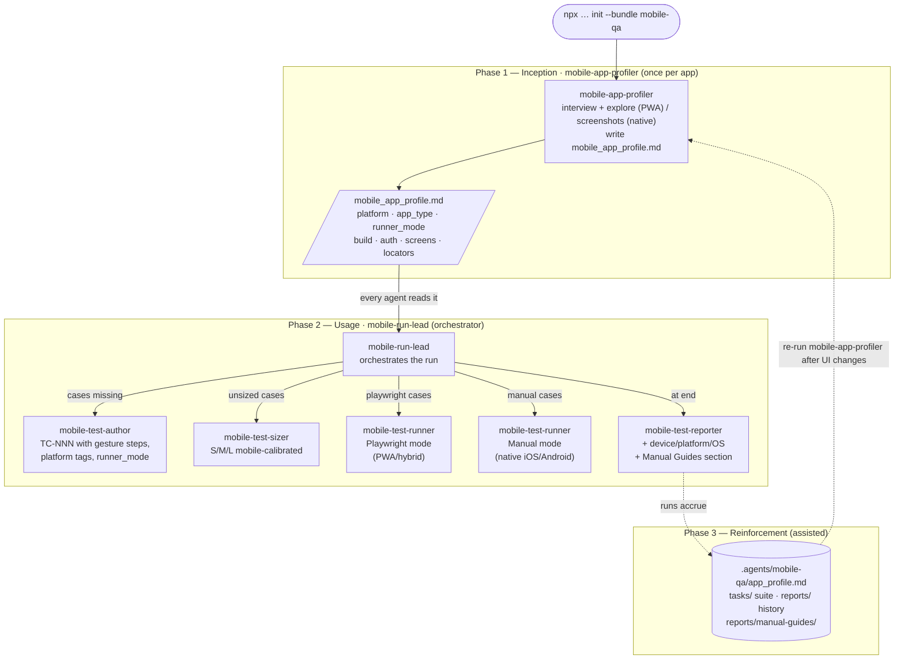

# Mobile QA Team

A standalone agentic manual-QA team for mobile apps. Cases are authored as
structured Markdown and run via Playwright MCP (PWA/hybrid, with mobile viewport
emulation) or guided manual mode (native iOS/Android). No test code is generated —
this is distinct from a Playwright or Appium automation engineer.

## Install

```bash
npx github:arozumenko/sdlc-skills init --bundle mobile-qa
```

Installs the 6 agents below into `.claude/agents/`, seeds mobile QA reference docs
into `.agents/mobile-qa/knowledge/`, and splices the team conventions into
`AGENTS.md` / `CLAUDE.md`.

## Quick Start

The team runs in **three phases**, parallel to the web-qa team. Unlike web-qa, the
runner has two modes — `playwright` for PWA/hybrid apps and `manual` (guided
execution) for native iOS/Android.

**Phase 1 — Inception (`mobile-app-profiler`, once per app).** _"Use the
mobile-app-profiler agent to onboard this app."_ It **interviews you** (platform,
app type, build access, auth, key flows, permissions) and — for PWA/hybrid apps —
explores the running app via Playwright MCP with mobile viewport, then writes
`.agents/mobile-qa/app_profile.md`. For native apps, it guides you to provide
screenshots and documents the UI structure from them. **The profile is authoritative:**
it determines the `runner_mode` (playwright vs manual) that every test case and runner will use.

**Phase 2 — Usage (`mobile-run-lead` orchestrates).** Launch `mobile-run-lead` as
the **active agent** with a suite path — it's the single orchestrator for a run:
- **`mobile-test-author`** — writes `tasks/<suite>/TC-NNN_<slug>.md` with mobile
  gesture steps, platform tags, and runner_mode set from the profile.
- **`mobile-test-sizer`** — scores cases S/M/L using mobile criteria (biometrics = L,
  push notifications = L, form + auth = M, simple taps = S).
- **`mobile-test-runner`** — one per case:
  - **Playwright mode**: runs live via Playwright MCP with mobile viewport + touch emulation, emits PASS/FAIL.
  - **Manual mode**: generates a step-by-step execution guide to `reports/manual-guides/`, emits BLOCKED.
- **`mobile-test-reporter`** — writes `reports/RUN-YYYY-MM-DD-NNN.md` with device/platform/OS context, runner mode breakdown, and a Manual Execution Guides section.

**Phase 3 — Reinforcement.** The project's knowledge grows through re-profiling
(re-run `mobile-app-profiler` after UI changes), the `tasks/` suite, and `reports/`
history. As with web-qa, no mining of transcripts — refinement comes from re-profiling
the live app and curating the suite.

### How It Flows



## Roster

| Role | Invoke | Does |
|---|---|---|
| `mobile-app-profiler` | mob-profiler | Onboards the app — determines platform/type/runner_mode, explores PWA/hybrid via Playwright MCP or interviews for native, writes `.agents/mobile-qa/app_profile.md` |
| `mobile-test-sizer` | mob-sizer | Rates cases S/M/L with mobile criteria; biometrics/push/background = L |
| `mobile-test-author` | mob-author | Authors formatted mobile test cases with gesture vocabulary, platform tags, runner_mode from profile |
| `mobile-run-lead` | mob-lead | **Run orchestrator** — assembles suite, dispatches sizer/author when needed, runs one runner per case, triggers reporter |
| `mobile-test-runner` | mob-runner | Executes one case: Playwright MCP + mobile viewport (playwright mode) or generates manual guide (manual mode) |
| `mobile-test-reporter` | mob-reporter | Collects results and writes the run report with device/platform/runner context |

## Runner Modes

| App type | Runner mode | What happens |
|----------|-------------|--------------|
| PWA | `playwright` | Test case runs live in the browser with mobile viewport + touch emulation. Returns PASS/FAIL. |
| Hybrid | `playwright` | Web views run via Playwright MCP. Native screen interactions flagged in Platform Notes. Returns PASS/FAIL. |
| Native iOS/Android | `manual` | Runner generates a step-by-step guide to `reports/manual-guides/TC-NNN-guide.md`. You execute on the device. Returns BLOCKED (expected). |

## Skills Used

- **`mobile-testing`** (bundle-local) — mobile execution workflow: Playwright mobile viewport patterns, gesture mapping, manual guide format
- **`playwright-testing`** (canonical monorepo) — base Playwright MCP workflow, reused by Playwright-mode runner
- **`systematic-debugging`** (obra/superpowers) — evidence-first debugging when steps fail
- **`verification-before-completion`** (obra/superpowers) — mandatory final-state check before PASS
- **`xlsx-reader`** (canonical monorepo) — read .xlsx test case input files

**Appium ecosystem skills** (available via `skills.json` for environment setup):
- `environment-setup-xcuitest` — XCUITest + Appium environment setup on macOS
- `xcuitest-real-device-config` — real iOS device setup for Appium
- `appium-troubleshooting` — diagnose Appium failures

## Integration with web-qa

Both bundles can be installed simultaneously in the same project — they use separate
namespaces (`.agents/web-qa/` vs `.agents/mobile-qa/`) and separate task/report
directories. A project with both a web frontend and a mobile app can run both teams
independently and maintain separate `app_profile.md` files.

## What This Bundle Adds

- **Agents** — the 6 local roles above (installed into `.claude/agents/`).
- **Instructions** — [`instructions.md`](instructions.md) → spliced into `AGENTS.md` / `CLAUDE.md`.
- **Seeded knowledge** — [`knowledge/`](knowledge/) → `.agents/mobile-qa/knowledge/` (mobile test-case format guide, template, report format).
- **Bundle-local skill** — [`skills/mobile-testing/`](skills/mobile-testing/) — mobile execution workflow (Playwright mobile viewport + manual guided mode patterns).

See [`bundle.json`](bundle.json) for the exact manifest and [`../SPEC.md`](../SPEC.md) for how bundles are defined and installed.
