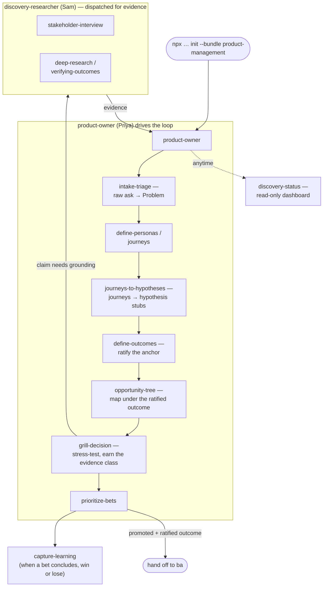

# Product Management

A Product Owner discovery pipeline — take a raw ask (feature request,
complaint, idea) all the way to a verified, prioritized hypothesis anchored to
a ratified outcome, ready to hand off to engineering as groomed backlog work.
Adapted from [PetroczyP/PO-RnD](https://github.com/PetroczyP/PO-RnD) (MIT), with
product-management insights drawn from
[mattpocock/skills](https://github.com/mattpocock/skills) (MIT) — see
[`NOTICE.md`](NOTICE.md) for full attribution and what was and wasn't ported.

## Install

```bash
npx github:arozumenko/sdlc-skills init --bundle product-management --target claude
```

Installs the 2 agents below into `.claude/agents/`, seeds the empty
`docs/discovery/` scaffold, and splices team conventions into
`AGENTS.md` / `CLAUDE.md`.

## Roster

| Role | Invoke | Does |
|---|---|---|
| `product-owner` | Priya / `po` | Owns the loop end to end — triages intake, frames problems, drafts outcomes and hypotheses, maps the opportunity tree, runs prioritization, guards the promotion gate |
| `discovery-researcher` | Sam | Gathers and stress-tests evidence — stakeholder interviews, desk/market research, adversarial verification — never decides what gets built |

## Skills

| Skill | Does |
|---|---|
| `intake-triage` | Front door for raw asks — verdicts Act Now / Plan Next / Collect More Signal / Decline-or-Defer and mints in-scope items as Problems |
| `define-personas` | Creates and maintains canonical persona cards under `docs/discovery/personas/` |
| `define-outcomes` | Drafts, stress-tests, and records ratification of outcome anchors in `outcomes.md` |
| `opportunity-tree` | Maintains the opportunity–solution tree as an overlay on existing artifacts; regenerates `outcome-tree.md`; applies the Torres 3+-solutions gate and Olsen scoring |
| `journeys-to-hypotheses` | Classifies journey coverage against existing hypotheses/tracker and authors missing problem + hypothesis stubs |
| `prioritize-bets` | Ranks incubating and promotion-ready bets (RICE by default, WSJF/ICE configurable) |
| `stakeholder-interview` | Prepares interview guides and synthesizes raw notes/transcripts into evidence, propagated into the hypotheses they touch |
| `grill-decision` | Socratic, one-question-at-a-time stress test of a decision, plan, or hypothesis |
| `capture-learning` | Captures a problem → outcome → lesson into `evidence/learnings/` when a hypothesis closes |
| `discovery-status` | Read-only dashboard of where the whole pipeline stands and the next action per item |

## How the loop works



`product-owner` is the entry point and stays the active agent throughout;
`discovery-researcher` is dispatched only when a claim needs evidence rather
than the PO's own judgment, and its findings return to the PO — it never
decides what gets built or promoted.

## `docs/discovery/` scaffold

Installed empty via `seed`. Holds problems, personas, journeys, hypotheses,
the `outcomes.md` / `decisions.md` registers, and
`evidence/` (intake, interviews, research, verifications, learnings). Derived
boards (`outcome-tree.md`, `journey-coverage.md`, `priority.md`) are generated
by skills at runtime — they are not seeded. See
[`discovery-scaffold/README.md`](discovery-scaffold/README.md) for the full
layout, ID conventions, and hypothesis lifecycle.

## Reused skills

These skills are **not** owned by this bundle — there's no duplicate copy
here. They're pulled in through each agent's `skills:` frontmatter via the
installer's normal resolution, which differs per skill:

- `deep-research`, `verifying-outcomes` — orphan entries in the top-level
  `skills.json`. Used by `discovery-researcher`'s evidence and verification
  work.
- `brainstorming` — a `repo:` entry in `skills.json`, fetched from upstream
  at install time. Used by `product-owner`'s framing work.
- `memory` — not in `skills.json`; resolves cross-bundle to the
  alphabetical-first bundle that owns it (`feature-development`'s copy).
  Used by both agents for role memory and checkpointing.

## What this bundle adds

- **Agents** — the 2 local roles above (installed into `.claude/agents/`).
- **Instructions** — [`instructions.md`](instructions.md) → spliced into `AGENTS.md` / `CLAUDE.md`.
- **Seeded scaffold** — [`discovery-scaffold/`](discovery-scaffold/) → `docs/discovery/` (empty registers and folders, no example content).
- **Bundle-owned skills** — [`skills/`](skills/) — the 10 skills in the table above, real directories this bundle physically owns (declared in `localSkills`). The same id may exist in another bundle or the top-level `skills/` catalog with different content — that's fine, there is no sync. Edit these copies directly.
- **Briefings** — _(none)_.

See [`bundle.json`](bundle.json) for the exact manifest, [`NOTICE.md`](NOTICE.md)
for the upstream MIT attribution, and the top-level [`../SPEC.md`](../SPEC.md)
for how bundles are defined and installed.
