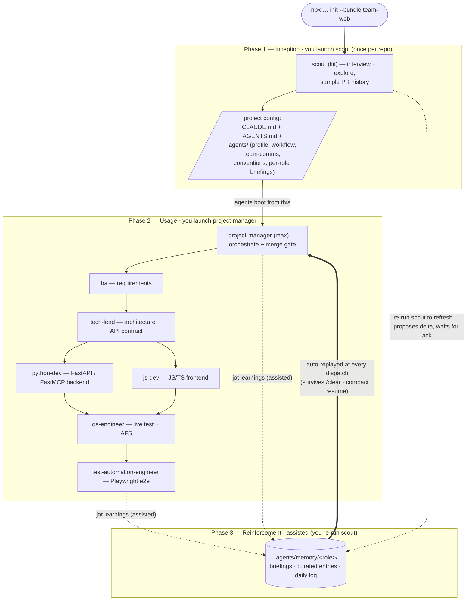

# Web Team

A fullstack web delivery team: **JS/TS frontend** talking to a **Python
backend** over an HTTP API, with QA, automation, and core coordination
roles.

## Install

```bash
npx github:arozumenko/sdlc-skills init --bundle team-web
```

Installs the agents below into your IDE (`.claude/`, `.cursor/`, …), pulls
each agent's skills, seeds per-role stack briefings into
`.agents/memory/<role>/`, and splices the team conventions into
`AGENTS.md` / `CLAUDE.md`.

The team runs in **three phases**. You launch only two agents yourself —
`scout`, then `project-manager`; the hooks and the orchestrator handle the
rest.

**Install (once)** — `npx github:arozumenko/sdlc-skills init --bundle team-web`.
Drops the agents into `.claude/`, pulls their skills, wires the
memory/context hooks, and splices `instructions.md` into `AGENTS.md`.

**Phase 1 — Inception (`scout`, once per repo).** Launch scout: _"Use the
scout agent to onboard this repo."_ It asks you what it can't infer,
explores the codebase (sampling PR history to learn how the team actually
works), then generates the project config — `CLAUDE.md`, `AGENTS.md`, and
the `.agents/` set (`profile.md`, `workflow.md`, `team-comms.md`,
`conventions.md`, `testing.md`) plus a per-role briefing under
`.agents/memory/<role>/`. **Why it's first:** every other agent boots from
these files; without them the team has no shared context. Re-run after big
structural changes.

**Phase 2 — Usage (`project-manager` + the team).** Hand Max a feature or
ticket: _"Use the project-manager agent to implement …"_. Max sequences the
work and dispatches `ba` → `tech-lead` → `python-dev` / `js-dev` →
`qa-engineer` → `test-automation-engineer`, then owns the merge gate. **The
logic:** each subagent starts in a *fresh* context, but at dispatch the
`agent-start` hook injects the shared `.agents/*` docs **and** that role's
own memory — so a subagent already knows the stack, conventions, and
routing without you re-explaining. You talk only to Max.

**Phase 3 — Reinforcement (assisted; owned by `scout`, not the PM).** Two
moving parts, and only one is automatic:
- **Replay is automatic.** The hooks re-inject each role's memory snapshot
  and the shared `.agents/*` docs at every dispatch (survives `/clear`,
  compaction, resume). This only replays what's already been written.
- **Capture is assisted.** Agents jot durable facts to
  `.agents/memory/<role>/` when they hit something worth keeping (or when
  you say "remember this"), and you periodically **re-run `scout`** to
  refresh the shared config and per-role briefings — scout re-reads the
  **code, PR history, and (via the `session-retrospective` skill) past agent
  sessions**, proposes the delta, and **waits for your ack**
  before writing. The PM only routes work; scout owns the durable project
  lens, so reinforcement is a scout job.

**Note:** mining past sessions is **on-demand, not automatic** — it happens
only when you run scout's `session-retrospective`, which proposes deltas you
must ack. The automatic half of reinforcement is just the hooks replaying
already-written `.agents/memory/` content at dispatch.

### How it flows



## Roster

| Role | Alias | Group | Does |
|---|---|---|---|
| `scout` | kit | core | Onboards the repo — finds the FE/BE split, the API contract, and per-side build/test commands |
| `ba` | alex | core | Turns requests into clear requirements and acceptance criteria |
| `tech-lead` | rio | core | Owns architecture and the frontend↔backend API contract |
| `project-manager` | max | core | Sequences work, tracks issues, coordinates the team |
| `python-dev` | py | dev | **Backend** — FastAPI services + FastMCP servers (async Python, Pydantic), data, business logic, API |
| `js-dev` | jay | dev | **Frontend** — JS/TS SPA/SSR, UI, client state, API client |
| `qa-engineer` | sage | qa | Executes tests against the running app + API; writes Automation-Friendly Specs |
| `test-automation-engineer` | axel | qa | Durable Playwright e2e through the real stack |

## How this team works

The **API contract is the seam.** Frontend and backend integrate through
the API schema; contract changes are two-sided and coordinated by the
tech-lead. Business logic lives in the backend; the frontend owns UI and
client state only. See [`instructions.md`](instructions.md) for the full
working agreements (installed into your project's `AGENTS.md`).

## What this bundle adds

- **Agents + skills** — the 8 roles above and their declared skills.
- **Instructions** — [`instructions.md`](instructions.md) → spliced into `AGENTS.md` / `CLAUDE.md`.
- **Briefings** — stack overlays in [`briefings/`](briefings/) → seeded into `.agents/memory/<role>/project_briefing.md` for `scout`, `tech-lead`, `python-dev`, `qa-engineer`, `test-automation-engineer` (scout refines them per project).
- **Skill overlays** — per-role capability tuning (fetched from `skills.json`): `fastapi` + `fastmcp-server` for `python-dev` and `tech-lead`; `vercel-react-best-practices` for `js-dev` and `tech-lead`.
- **Hooks** — _(none yet)_.

See [`bundle.json`](bundle.json) for the exact manifest and the top-level
[`../SPEC.md`](../SPEC.md) for how bundles are defined and installed.
