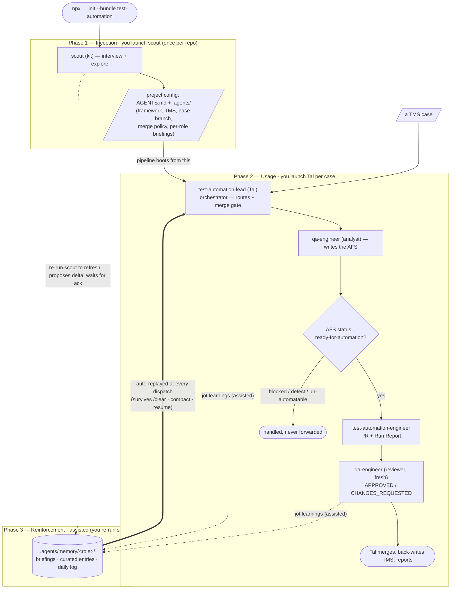

# Test Automation Team (`test-automation`)

An automation-focused agent team that turns TMS cases into merged, honest
automated tests. A lead orchestrator (Tal) runs an analyst → implementer →
reviewer pipeline, owns test-framework architecture, and owns the automation
merge gate.

## Install

```bash
npx github:arozumenko/sdlc-skills init --bundle test-automation
```

## Quick start

The pipeline runs in **three phases**. You launch `scout` once, then drive
**Tal** directly for every automation task; Tal dispatches the analyst →
implementer → reviewer pipeline as subagents.

**Install (once)** — `npx github:arozumenko/sdlc-skills init --bundle test-automation`.
Drops the four agents into `.claude/`, pulls their skills (incl.
`test-automation-workflow` + `test-case-analysis`), wires the memory/context
hooks, and splices `instructions.md` into `AGENTS.md`.

**Phase 1 — Inception (`scout`, once per repo).** Launch scout: _"Use the
scout agent to onboard this repo."_ It asks you what it can't infer,
explores the repo, then generates the project config — `AGENTS.md` plus the
`.agents/` set, recording the test framework, TMS adapter, base branch,
merge policy, and credential matrix into `profile.md` / `workflow.md`, and
seeding a per-role briefing under `.agents/memory/<role>/`. **Why it's
first:** if the project isn't seeded, Tal pauses and asks for a scout run
before doing anything else — the whole pipeline reads this config.

**Phase 2 — Usage (Tal runs the pipeline).** Drop a TMS case on Tal: _"Use
the test-automation-lead agent to automate TC-1234."_ He routes it through
the **analyst** (`qa-engineer` writes the AFS) → the
**`ready-for-automation` gate** → the **implementer**
(`test-automation-engineer` opens a PR + Run Report) → the **reviewer**
(`qa-engineer`, fresh session), then merges, files follow-ups, back-writes
the TMS, and reports to you. **The logic:** each subagent boots from a fresh
context that the `agent-start` hook seeds with the shared `.agents/*` config
and its own memory — so the analyst, implementer, and reviewer already know
the framework, merge policy, and TMS adapter.

**Phase 3 — Reinforcement (assisted; owned by `scout`, not Tal).** Two
moving parts, and only one is automatic:
- **Replay is automatic.** The hooks re-inject each role's memory snapshot
  and the shared `.agents/*` config at every dispatch (survives `/clear`,
  compaction, resume) — it only replays what's already written.
- **Capture is assisted.** The pipeline agents jot durable facts (framework
  quirks, recurring flake causes, review patterns) into
  `.agents/memory/<role>/` when worth keeping, and you periodically **re-run
  `scout`** to refresh the shared config + briefings — scout re-reads the
  **code, PR history, and (via the `session-retrospective` skill) past agent
  sessions**, proposes the delta, and **waits for your ack**.
  Tal orchestrates the pipeline; scout owns the durable project lens, so the
  refresh is a scout job.

**Note:** mining past sessions is **on-demand, not automatic** — it happens
only when you run scout's `session-retrospective`, which proposes deltas you
must ack. The automatic half of reinforcement is just the hooks replaying
already-written `.agents/memory/` content at dispatch.

### How it flows



## Roster

| Role | Agent | Source | Job |
|---|---|---|---|
| Lead / orchestrator (PM + tech-lead combined) | `test-automation-lead` (Tal) | bundle-local | Routes the pipeline, owns framework architecture + the automation merge gate. The user launches Tal directly. |
| Onboarding | `scout` | shared | Seeds framework / TMS / base branch / merge policy into `.agents/`. |
| Implementer | `test-automation-engineer` (Axel) | shared | Turns a ready AFS into a PR + Run Report. |
| Analyst + Reviewer | `qa-engineer` (Sage) | shared | Writes the AFS (analyst); reviews for test honesty (reviewer, fresh session). |

The pipeline-critical skills — `test-automation-workflow` and
`test-case-analysis` — are installed explicitly with the bundle (and also via the
agents that declare them). The Xray TMS adapter (`xray-testing`) loads
conditionally, only when the project declares `tms.adapter: xray`.

## When to use it

- A **test-automation-only** engagement, or any project where automation work
  runs as its own pipeline with a dedicated lead.
- You want a single orchestrator (Tal) to own routing, framework decisions, and
  the automation merge — without standing up a full feature-development team.

Compared to **`team-web`**, which includes `test-automation-engineer` +
`qa-engineer` as part of a fullstack delivery team but has no automation
orchestrator, this bundle adds Tal and focuses the whole team on the
TMS → merged-test pipeline.

## What gets installed

- The four agents above (Tal copied from this bundle; the other three from the
  shared catalog), with their declared skills.
- `test-automation-workflow` + `test-case-analysis` skills (explicit).
- Project briefings seeded to `.agents/memory/<role>/project_briefing.md` for all
  four roles.
- Team conventions spliced into `AGENTS.md` (inside
  `<!-- BUNDLE:test-automation -->` markers).
