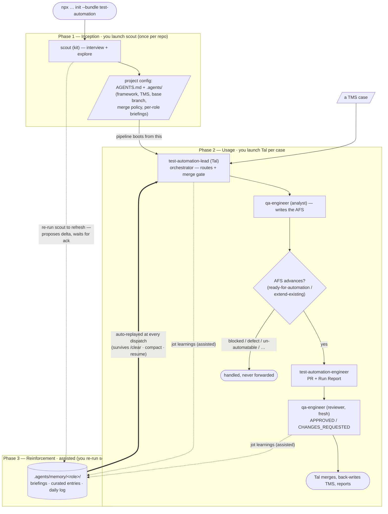

# Test Automation Team (`test-automation`)

A **universal** automation-focused agent team that turns TMS cases into merged,
honest automated tests — across **any framework, any test type (UI, API, mobile,
performance, …), and any TMS.** The team matches whatever the project already
uses rather than imposing a tool. A lead orchestrator (Tal) runs an analyst →
implementer → reviewer pipeline, owns test-framework architecture, and owns the
automation merge gate.

## Install

```bash
npx github:arozumenko/sdlc-skills init --bundle test-automation
```

## Quick start

The pipeline runs in **three phases**. You launch `scout` once, then drive
**Tal** directly for every automation task; Tal dispatches the analyst →
implementer → reviewer pipeline as subagents.

Launch each as your **main agent** straight from the terminal (Claude Code):

```bash
claude --agent scout                 # Phase 1 — seed the repo (once)
claude --agent test-automation-lead  # Phase 2+ — drive every automation task
```

**Install (once)** — `npx github:arozumenko/sdlc-skills init --bundle test-automation`.
Drops the four agents into `.claude/`, pulls their skills (incl.
`test-automation-workflow` + `test-case-analysis`), wires the memory/context
hooks, and splices `instructions.md` into `AGENTS.md`.

**Before Phase 1 — two prerequisites.** scout's tool-wiring inspects the
**live MCP servers + installed skills** on the host, so wire those *before*
scouting: **(A)** install any project-specific skills the roster doesn't declare
— find them with `npx skills find <tech>` (e.g. `playwright`, `appium`) or the
registry catalogue ([`skills.json`](../../skills.json)), and **(B)** wire MCP /
connectivity in the **host** (never the repo) — the installer can do it:
`init --bundle test-automation --interactive` (menu) or `--mcp playwright,atlassian,onetest,elitea-next`.
Full detail — plus the **way-of-work** you set at seeding (task source, TMS/tracker
reporting, bug-vs-subtask filing, branch + PR policy):
[onboarding § Prerequisites → Before you seed](../../docs/onboarding/test-automation.md#before-you-seed).

**Phase 1 — Inception (`scout`, once per repo).** Launch scout as your main
agent — `claude --agent scout` — then tell it: _"Onboard this repo for the
test-automation workflow."_ It asks you what it can't infer,
explores the repo, then generates the project config — `AGENTS.md` plus the
`.agents/` set, recording the test framework, TMS adapter, base branch,
merge policy, and credential matrix into `profile.md` / `workflow.md`, and
seeding a per-role briefing under `.agents/memory/<role>/`. **Why it's
first:** the whole pipeline reads this config. scout is the thorough, dedicated
onboarding pass (full interview, PR-history mining, the `session-retrospective`
refresh). Skip it and Tal still **self-orients** — he runs the *same*
`seeding-a-project` skill himself to seed the `.agents/*` set rather than
dead-stopping — but a deliberate scout pass is richer, so prefer it when you can.

You don't need to fill in a rigid form — plain language works, scout will ask
for whatever's missing:

> Onboard this repo for the test-automation workflow. We track work in Jira,
> project `PLAT` (https://ourco.atlassian.net/browse/PLAT). Test cases live in
> Zephyr Scale, same project key. I'll drop you case IDs to automate — file
> each as a sub-task under our `PLAT-4200` automation epic. If you find a bug
> along the way, open it as its own Jira ticket (not a sub-task) and link the
> case ID in the description. After a run, push pass/fail back to the Zephyr
> Scale execution record so the TMS stays honest — don't skip that. PRs branch
> off `develop`; auto-merge once review green, that's fine by
> default. Ask me about anything else you need.

For a **GitHub-only** shop (no Jira) it reads just as plainly:

> Onboard this repo. Everything's tracked as GitHub issues in this repo — no
> separate TMS, test cases live as markdown under `test-specs/`. File each
> automation task as its own issue under the `Automation` milestone, and open
> bugs as regular issues too, linked back to the file. Auto-merge is fine.

See [onboarding § Seed via scout](../../docs/onboarding/test-automation.md#2-seed-via-scout)
for the full field-by-field prompt if you'd rather be explicit up front.

**Phase 2 — Usage (Tal runs the pipeline).** Launch Tal as your main agent —
`claude --agent test-automation-lead` — and drop a TMS case on him: _"Automate
TC-1234."_ He routes it through
the **analyst** (`qa-engineer` writes the AFS) → the
**status gate** (`ready-for-automation` and `extend-existing` advance) → the **implementer**
(`test-automation-engineer` opens a PR + Run Report) → the **reviewer**
(`qa-engineer`, fresh session), then merges, files follow-ups, back-writes
the TMS, and reports to you. **The logic:** each subagent boots from a fresh
context that the `agent-start` hook seeds with the shared `.agents/*` config
and its own memory — so the analyst, implementer, and reviewer already know
the framework, merge policy, and TMS adapter.

**Phase 3 — Reinforcement (assisted; owned by `scout`, not Tal).** Two
moving parts, and only one is automatic:
- **Replay is automatic.** The hooks re-inject each role's memory snapshot
  and the shared `.agents/*` config at every dispatch (survives `/clear`,
  compaction, resume) — it only replays what's already written.
- **Capture is assisted.** The pipeline agents jot durable facts (framework
  quirks, recurring flake causes, review patterns) into
  `.agents/memory/<role>/` when worth keeping, and you periodically **re-run
  `scout`** to refresh the shared config + briefings — scout re-reads the
  **code, PR history, and (via the `session-retrospective` skill) past agent
  sessions**, proposes the delta, and **waits for your ack**.
  Tal orchestrates the pipeline; scout owns the durable project lens, so the
  refresh is a scout job.

**Note:** mining past sessions is **on-demand, not automatic** — it happens
only when you run scout's `session-retrospective`, which proposes deltas you
must ack. The automatic half of reinforcement is just the hooks replaying
already-written `.agents/memory/` content at dispatch.

### How it flows


```mermaid
flowchart TD
    install(["npx … init --bundle test-automation"]) --> scout

    subgraph p1["Phase 1 — Inception · you launch scout (once per repo)"]
        scout["scout (kit) — interview + explore"]
        seed[/"project config: AGENTS.md + .agents/<br/>(framework, TMS, base branch,<br/>merge policy, per-role briefings)"/]
        scout --> seed
    end

    subgraph p2["Phase 2 — Usage · you launch Tal per case"]
        tal["test-automation-lead (Tal)<br/>orchestrator — routes + merge gate"]
        analyst["qa-engineer (analyst) — writes the AFS"]
        gate{"AFS advances?<br/>(ready-for-automation /<br/>extend-existing)"}
        impl["test-automation-engineer<br/>PR + Run Report"]
        review["qa-engineer (reviewer, fresh)<br/>APPROVED / CHANGES_REQUESTED"]
        merge(["Tal merges, back-writes TMS, reports"])
        stop(["handled, never forwarded"])
        tal --> analyst --> gate
        gate -->|"yes"| impl --> review --> merge
        gate -->|"blocked / defect / un-automatable / …"| stop
    end

    seed -->|"pipeline boots from this"| tal
    case[/"a TMS case"/] --> tal

    subgraph p3["Phase 3 — Reinforcement · assisted (you re-run scout)"]
        mem[(".agents/memory/&lt;role&gt;/<br/>briefings · curated entries · daily log")]
    end

    tal -. "jot learnings (assisted)" .-> mem
    review -. "jot learnings (assisted)" .-> mem
    scout -. "re-run scout to refresh —<br/>proposes delta, waits for ack" .-> mem
    mem == "auto-replayed at every dispatch<br/>(survives /clear · compact · resume)" ==> tal
```

## Roster

| Role | Agent | Source | Job |
|---|---|---|---|
| Lead / orchestrator (PM + tech-lead combined) | `test-automation-lead` (Tal) | bundle-local | Routes the pipeline, owns framework architecture + the automation merge gate. The user launches Tal directly. |
| Onboarding | `scout` | bundle-local | Seeds framework / TMS / base branch / merge policy into `.agents/`. |
| Implementer | `test-automation-engineer` (Axel) | bundle-local | Turns a ready AFS into a PR + Run Report. |
| Analyst + Reviewer | `qa-engineer` (Sage) | bundle-local | Writes the AFS (analyst); reviews for test honesty (reviewer, fresh session). |

The pipeline-critical skills — `test-automation-workflow` and
`test-case-analysis` — are bundle-local (`localSkills` in `bundle.json`) and
install with the agents that declare them in their frontmatter. The project's TMS adapter skill loads conditionally
(e.g. `xray-testing` for an Xray project, only when the project declares
`tms.adapter: xray`).

## When to use it

- A **test-automation-only** engagement, or any project where automation work
  runs as its own pipeline with a dedicated lead.
- You want a single orchestrator (Tal) to own routing, framework decisions, and
  the automation merge — without standing up a full feature-development team.

Compared to **`feature-development`**, which includes `test-automation-engineer` +
`qa-engineer` as part of a cross-platform delivery team but has no automation
orchestrator, this bundle adds Tal and focuses the whole team on the
TMS → merged-test pipeline.

## What gets installed

- The four agents above (all bundle-owned — Tal and the other three copied from
  this bundle), with their declared skills.
- `test-automation-workflow` + `test-case-analysis` skills (bundle-local, via
  `localSkills` + the agents' frontmatter).
- Project briefings seeded to `.agents/memory/<role>/project_briefing.md` for all
  four roles.
- Team conventions spliced into `AGENTS.md` (inside
  `<!-- BUNDLE:test-automation -->` markers).
