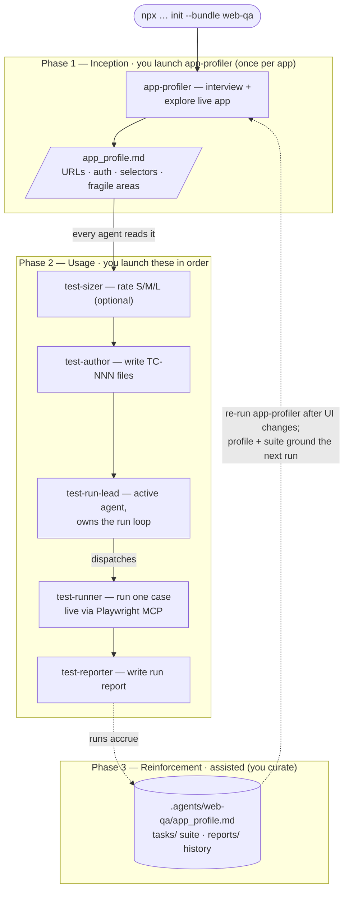

# Web QA Team

A standalone agentic manual-QA team for web apps. Cases are authored as
structured Markdown and run live via Playwright MCP — no test code is
generated, making this distinct from a Playwright automation engineer.

## Install

```bash
npx github:arozumenko/sdlc-skills init --bundle web-qa
```

Installs the 6 agents below into `.claude/agents/`, seeds QA reference docs
into `.agents/web-qa/knowledge/`, and splices the team conventions into
`AGENTS.md` / `CLAUDE.md`.

The team runs in **three phases**. Unlike the other bundles there is no
`scout` and no single orchestrator: `app-profiler` onboards, then you run
the authoring/running agents **in order**.

**Install (once)** — `npx github:arozumenko/sdlc-skills init --bundle web-qa`.
Installs the 6 agents into `.claude/agents/`, seeds reference docs into
`.agents/web-qa/knowledge/`, wires the context hooks, and splices
`instructions.md` into `AGENTS.md`.

**Phase 1 — Inception (`app-profiler`, once per app).** _"Use the
app-profiler agent to onboard this app."_ It **interviews you** (base URL,
what the app does, auth + test credentials, the 3–5 key flows, user roles,
external-service flows), then explores the running app live via Playwright
MCP and writes `.agents/web-qa/app_profile.md` (URLs, auth, key pages,
reliable selectors, fragile areas). **Why it's first:** there's no scout
here — `app-profiler` is the onboarding agent, and every other web-qa agent
reads this profile before acting.

**Phase 2 — Usage (size → author → run).**
- **`test-sizer`** (optional) rates cases S/M/L for agent-execution cost.
- **`test-author`** turns a feature/flow description into
  `tasks/<suite>/TC-NNN_<slug>.md` (URLs as `{{base_url}}/path`).
- **`test-run-lead`** — launch as the **active agent** with a `base_url`. It
  discovers the suite, dispatches one `test-runner` per case (each runs live
  via Playwright MCP and must capture a confirming snapshot to record PASS),
  then triggers `test-reporter` to write `reports/RUN-YYYY-MM-DD-NNN.md`.
  Don't invoke `test-runner` / `test-reporter` by hand during a led run.
  **The logic:** every agent reads `app_profile.md` for selectors and auth,
  so cases and runs stay grounded in the real app.

**Phase 3 — Reinforcement (assisted; you curate — there's no scout here).**
The project's knowledge lives in durable, growing artifacts that every agent
re-reads on each run: `.agents/web-qa/app_profile.md` (**re-run
`app-profiler`** after UI changes to refresh selectors and flows), the
`tasks/` suite (a living regression set), and the `reports/` history. None
of this is automatic — you decide when to re-profile and which cases to
keep. **The payoff:** runs get more reliable as the profile sharpens and the
suite grows — the team builds a lasting QA memory of *this* app rather than a
one-off pass. There is no mining of past chat or sub-agent transcripts;
refinement comes from re-profiling the live app and curating the suite.

### How it flows



## Roster

| Role | Invoke | Does |
|---|---|---|
| `app-profiler` | profiler | Onboards the app — explores the UI, maps flows, writes `.agents/web-qa/app_profile.md` |
| `test-sizer` | sizer | Rates cases S/M/L for AI-agent execution cost; sizes descriptions before authoring and scores existing TC files into their `size:` frontmatter |
| `test-author` | author | Takes a feature or flow description and authors formatted test cases under `tasks/<suite>/` |
| `test-run-lead` | lead | Discovers the suite to run, dispatches `test-runner` sub-runs via the Agent tool, triggers `test-reporter` |
| `test-runner` | runner | Runs one test case live via Playwright MCP and emits a structured JSON result |
| `test-reporter` | reporter | Collects test-runner results and writes the run report to `reports/` |

## How this team works

Run the agents in order: **app-profiler → test-sizer → test-author → test-run-lead → test-runner → test-reporter**. `test-run-lead` owns the run loop and must be invoked as the
**active agent** (it dispatches `test-runner` sub-runs via the Agent tool).

Test cases live in `tasks/<suite>/TC-NNN_<slug>.md`; run reports land in
`reports/RUN-YYYY-MM-DD-NNN.md` with screenshots in `reports/screenshots/`.
Reference docs (format guide, templates, report format) are seeded to
`.agents/web-qa/knowledge/` at install time.

All test-case URLs use `{{base_url}}` — the test-run-lead or test-runner
substitutes the real base URL at run time, keeping cases environment-agnostic
across dev, staging, and prod.

## What this bundle adds

- **Agents** — the 6 local roles above (installed into `.claude/agents/`).
- **Instructions** — [`instructions.md`](instructions.md) → spliced into `AGENTS.md` / `CLAUDE.md`.
- **Seeded knowledge** — [`knowledge/`](knowledge/) → `.agents/web-qa/knowledge/` (test-case format guide, template, report format).
- **Skills it pulls** — `playwright-testing`, `playwright-best-practices`, `verification-before-completion`, `systematic-debugging`, `xlsx-reader` (declared in the relevant agent frontmatter).
- **Briefings** — _(none)_.
- **Hooks** — _(none)_.

See [`bundle.json`](bundle.json) for the exact manifest and the top-level
[`../SPEC.md`](../SPEC.md) for how bundles are defined and installed.
